> 日々私たちが過ごしている日常は、実は、奇迹の連続なのかもしれな。 
> 我们所度过的每个平凡的日常，也许就是连续发生的奇迹。
> ——《日常》

能让我过上写代码和看番这样的日常，可能就是连续发生的奇迹吧。

# 介绍

**全功能弹幕播放器**，项目逐步推进中...（咕咕咕

# 架构

	

为了更方便地维护，引入中间层，用`node.js`实现代码复用。同时引入`插件`概念，设计思想类似于`typecho`中的插件。同时，由于政策受限，iOS客户端将只实现最基本的功能。

- [介绍](#介绍)
- [架构](#架构)
	- [设想 & 可能用到的技术栈](#设想--可能用到的技术栈)
		- [Server](#server)
			- [🌏 番剧数据库构建](#-番剧数据库构建)
			- [🌏 文件hash数据库构建](#-文件hash数据库构建)
			- [🌏 网站, 信息通知服务](#-网站-信息通知服务)
			- [🌏 信息聚合数据库构建](#-信息聚合数据库构建)
			- [Web Server / API](#web-server--api)

## 设想 & 可能用到的技术栈

- ✅: 完成, 🚧: 施工中, ❌: 未开始
- 🌏: 开源, 🔒: 闭源

### Server

#### 🌏 番剧数据库构建

- 总体思路
  - Bangumi定时爬虫，日后可能添加其他数据库如AniDB
- 实现思路
  - Scrapy, Python
  - 参考: https://github.com/AllenTom/Bangumi-Spider-API
- 数据库与工具都会开源
- 不考虑
  - https://github.com/bangumi-data/bangumi-data , 原因：人工、延迟、没有特殊番剧

#### 🌏 文件hash数据库构建

- 总体思路
  - 定时遍历番剧数据库
  - 以番剧条目名称作为关键词搜索各大资源站
  - 获取文件名与hash值的对应
  - 对文件名进行分词，然后算出针对各个番剧的似然 (likelihood)
	- [为什么要这么做？] 举例: 如果用京阿尼的《日常》的罗马音`Nichijou`作为关键词搜索，很轻易地便能得到《魔物娘的同居日常》诸如此类的结果，所以我们需要一定的算法来规避类似于这样的问题。
  - 对所有计算得到的番剧似然取`argmax`归类番剧
  - 另外：由于种子长期存在于BT网络上，所以在经历过一次大扫描之后，只需要定时关心资源站内新上传的资源了，不必重复计算。此外，为避免特殊情况，可以考虑对处理过的条目进行记录缓存。
- 实现思路
  - Python
  - node.js
- 数据库与工具都会开源

#### 🌏 网站, 信息通知服务

- 总体思路: 做/使用一套完善的信息发布工具
- 实现思路
  - 现有博客框架
  - GitHub Pages?

#### 🌏 信息聚合数据库构建

- 总体思路: 现有平台抓取
- 实现思路
  - Python
  - Go

#### Web Server / API

- 涵盖内容
  - 🌏 番剧识别服务: 借助文件hash数据库实现
  - 🌏 私有弹幕池服务
  - 🌏 用户服务 (追番管理与bgm.tv同步)
  - 🔒 用户贡献番剧与其他网站链接的服务
	- 我们提倡开源思想，所以这个数据库将会开源
  - 🌏 信息、通知服务
  - 🌏 推荐、时间表, 等其他信息聚合服务
- 实现思路
  - Go
  - Python, Django / Flask / FastAPI
