> 日々私たちが過ごしている日常は、実は、奇迹の連続なのかもしれな。 
> 我们所度过的每个平凡的日常，也许就是连续发生的奇迹。
> ——《日常》

能让我过上写代码和看番这样的日常，可能就是连续发生的奇迹吧。

# 介绍

**全功能弹幕播放器**，项目逐步推进中...（咕咕咕

# 架构

	

为了更方便地维护，引入中间层，用`node.js`实现代码复用。同时引入`插件`概念，设计思想类似于`typecho`中的插件。同时，由于政策受限，iOS客户端将只实现最基本的功能。

- [介绍](#介绍)
- [架构](#架构)
	- [设想 & 可能用到的技术栈](#设想--可能用到的技术栈)
		- [Server](#server)
			- [🌏 番剧数据库构建](#-番剧数据库构建)
			- [🌏 文件hash数据库构建](#-文件hash数据库构建)
			- [🌏 网站, 信息通知服务](#-网站-信息通知服务)
			- [🌏 信息聚合数据库构建](#-信息聚合数据库构建)
			- [🌏 与视频网站链接的数据库构建](#-与视频网站链接的数据库构建)
			- [Web Server / API](#web-server--api)
			- [🌏 网页](#-网页)

## 设想 & 可能用到的技术栈

- ✅: 完成, 🚧: 施工中, ❌: 未开始
- 🌏: 开源, 🔒: 闭源

### Server

#### 🌏 番剧数据库构建

- 总体思路
  - Bangumi定时爬虫，日后可能添加其他数据库如AniDB
- 实现思路
  - Scrapy, Python
  - 参考: https://github.com/AllenTom/Bangumi-Spider-API
- 数据库与工具都会开源
- 不考虑
  - https://github.com/bangumi-data/bangumi-data , 原因：人工、延迟、没有特殊番剧

注意：我们会开源两个数据库：
1. 最小必要数据库，即所以番剧名称（包括别名、不同语言）与番剧ID匹配的数据库
2. 全数据库

由于额外的番剧数据 (全数据库提供) 可以由本地端对 bgm.tv 进行爬取，所以我们也会提供本地端爬取的组件。但是，全数据库仍然是有意义的：
1. 更加方便，因为部分 bgm.tv 的数据需要 Cookies (由用户提供)，增加了用户的使用学习成本
2. 我们开源在GitHub上的数据库可以提供全球jsDelivr加速

流程框架：

	

#### 🌏 文件hash数据库构建

- 总体思路
  - 定时遍历番剧数据库
  - 以番剧条目名称作为关键词搜索各大资源站
  - 获取文件名与hash值的对应
  - 对文件名进行分词，然后算出针对各个番剧的似然 (likelihood)
	- 【为什么要这么做？】 举例: 如果用京阿尼的《日常》的罗马音`Nichijou`作为关键词搜索，很轻易地便能得到《魔物娘的同居日常》诸如此类的结果，所以我们需要一定的算法来规避类似于这样的问题。
  - 对所有计算得到的番剧似然取`argmax`归类番剧
  - 另外：由于种子长期存在于BT网络上，所以在经历过一次大扫描之后，只需要定时关心资源站内新上传的资源了，不必重复计算。此外，为避免特殊情况，可以考虑对处理过的条目进行记录缓存。
  - https://share.dmhy.org
  - https://acg.rip
  - http://bt.acg.gg
  - http://www.kisssub.org
  - http://mikanani.me
  - http://www.nyaa.si
- 特殊数据
  - 琉璃神社 https://www.llss.at/wp/
  - 直接爬取上面的hash值，随后进行文件名匹配
- 实现思路
  - Python
  - node.js
- 数据库与工具都会开源
- 参考工具：
  - [油猴脚本 Bangumi动画搜索 跳转AniDB/MyAnimeList/ANN/TMDB和动漫花园等BT站/在线播放站一键跳转](https://greasyfork.org/zh-CN/scripts/405283-bangumi%E5%8A%A8%E7%94%BB%E6%90%9C%E7%B4%A2-%E8%B7%B3%E8%BD%ACanidb-myanimelist-ann-tmdb%E5%92%8C%E5%8A%A8%E6%BC%AB%E8%8A%B1%E5%9B%AD%E7%AD%89bt%E7%AB%99-%E5%9C%A8%E7%BA%BF%E6%92%AD%E6%94%BE%E7%AB%99%E4%B8%80%E9%94%AE%E8%B7%B3%E8%BD%AC-2020%E5%B9%B46%E6%9C%8813%E6%97%A5)

#### 🌏 网站, 信息通知服务

- 总体思路: 做/使用一套完善的信息发布工具
- 实现思路
  - 现有博客框架
  - GitHub Pages?

#### 🌏 信息聚合数据库构建

- 总体思路: 现有平台抓取
  - https://github.com/wxt2005/bangumi-list
  - https://bgmlist.com/
  - https://www.kansou.me/
- 实现思路
  - Python
  - Go

#### 🌏 与视频网站链接的数据库构建

- 待定
  - 精确到介绍页的数据：https://github.com/bangumi-data/bangumi-data
  - 通过搜索进行定位
  - 插件服务：传入参数可以为番剧名称

#### Web Server / API

- 涵盖内容
  - 🌏 番剧识别服务: 借助文件hash数据库实现
  - 🌏 私有弹幕池服务
  - 🌏 用户服务 (追番管理与bgm.tv同步)
  - 🔒 用户贡献番剧与其他网站链接的服务
	- 我们提倡开源思想，所以这个数据库将会开源
  - 🌏 信息、通知服务
  - 🌏 推荐、时间表, 等其他信息聚合服务
- 实现思路
  - Go
  - Python, Django / Flask / FastAPI
  - rust (好像是人类之光)

#### 🌏 网页

- 目标: 提供网页端的API服务
- 实现思路
  - Vue
  - 前后端分离
