此文档将详细描述各组件的技术实现以及规范。

- [Server](#server)
	- [番剧数据库的构建](#番剧数据库的构建)
		- [总架构](#总架构)
		- [`Spider` 推荐实现](#spider-推荐实现)
		- [`Matcher` 实现细节](#matcher-实现细节)
		- [`Publisher` 实现细节](#publisher-实现细节)
		- [关于日期与时间](#关于日期与时间)
		- [自定义数据结构](#自定义数据结构)
			- [`[Object] NameDistance`](#object-namedistance)
			- [`[Object] RelatedItem`](#object-relateditem)
			- [`[Object] AnimeSite`](#object-animesite)
			- [`[Enum] AnimeEpisodeType`](#enum-animeepisodetype)
			- [`[Enum] AnimeRegion`](#enum-animeregion)
			- [`[Enum] AiringStatus`](#enum-airingstatus)
		- [爬取数据库规范](#爬取数据库规范)
			- [关于`id`](#关于id)
			- [`Spider: Tables`](#spider-tables)
			- [`Spider: [Table] anime`](#spider-table-anime)
			- [`Spider: [Table] episode`](#spider-table-episode)
			- [`Spider: [Table] anime_name`](#spider-table-anime_name)
			- [`Spider: [Table] episode_name`](#spider-table-episode_name)
			- [`Spider: [Table] log`](#spider-table-log)
			- [`Spider: [Table] request_failed`](#spider-table-request_failed)
			- [`Spider: [Table] cache`](#spider-table-cache)
		- [内部数据库规范](#内部数据库规范)
			- [内部`ID` (`Nichijou ID`)](#内部id-nichijou-id)
			- [`Nichijou: Tables`](#nichijou-tables)
			- [`Nichijou: [Table] anime`](#nichijou-table-anime)
			- [`Nichijou: [Table] anime_name`](#nichijou-table-anime_name)
			- [`Nichijou: [Table] episode_name`](#nichijou-table-episode_name)
			- [`Nichijou: [Table] match_fail`](#nichijou-table-match_fail)
			- [`Nichijou: [Table] conflict`](#nichijou-table-conflict)
			- [`Nichijou: [Table] revise`](#nichijou-table-revise)
			- [`Nichijou: [Table] sites`](#nichijou-table-sites)
			- [`Nichijou: [Table] sources`](#nichijou-table-sources)
			- [`Nichijou: [Table] log`](#nichijou-table-log)
		- [发布数据规范](#发布数据规范)
			- [`nichijou-db-essential`](#nichijou-db-essential)
			- [`nichijou-db-anime`](#nichijou-db-anime)
				- [发布数据种类](#发布数据种类)
				- [发布数据格式 (动画条目)](#发布数据格式-动画条目)
				- [发布数据格式 (剧集条目)](#发布数据格式-剧集条目)
				- [额外发布数据 (元数据)](#额外发布数据-元数据)
			- [`nichijou-db-episode-name`](#nichijou-db-episode-name)
		- [发布数据方式](#发布数据方式)

# Server

## 番剧数据库的构建

### 总架构

番剧数据库的大部分数据源于爬取。爬取的数据将根据**爬取数据库规范**进行数据转换存入相应的数据库。在爬取之后，爬取得到的数据将会与**内部数据库**中已有的数据进行匹配，根据**内部数据库规范**进行合理储存。在完成上述工作之后，将会根据**发布数据规范**将数据以多种形式分发。

除此之外，**内部数据库**还包含了社区修订、维护的数据。

总结一下，整个数据库构建过程中的数据流动可以拆分为两个部分：
- **爬虫自动爬取发布部分**
  - **爬取数据** `Spider`
  - **转换数据** `Converter` (一般包含在`Spider`当中)
  - **匹配数据** `Matcher`
  - **发布数据** `Publisher`
- **人工处理部分**
  - 解决 `Matcher` 未能精确匹配的问题
  - 解决 `Publisher` 发布时多个数据源数据冲突 (默认情况下会有合并优先级)
  - 人工修订数据

**注意：这里的蜘蛛 / 爬取 / `Spider`是指比较广义的爬虫，包括有一定的数据源进行解析、直接读取API等操作。为方便阐述，统一使用蜘蛛指代。**



### `Spider` 推荐实现

使用`Python`的`Scrapy`框架进行开发。我们将提供部分`Converter`以及数据库相关的，可以共用的代码。

### `Matcher` 实现细节

新增数据源中的`name`字段将会与**内部数据库**进行模糊匹配，计算出编辑距离 (Levenshtein距离)。如果某一条目的任意一个`name`可以精确匹配 (即编辑距离为0)，则确认匹配，反之，将记录下与每条`name`前五小的编辑距离。

此外，由于某些相似的条目可能会有相同的别名，所以在进行`Matcher`匹配之前，我们会筛选出重复项。匹配的过程当中，如果某一项为重复项，那么他的编辑距离将被设置为`-1`，同样需要进行人工校验（其他别名成功匹配除外）。关于这一点，可以参考[`Nichijou: [Table] match_fail`](#nichijou-table-match_fail)

### `Publisher` 实现细节

根据**内部数据库**的匹配数据，综合来自多个数据源的信息，并进行确认、核实。

### 关于日期与时间

本项目中对于日期**不采用**ISO 8601标准。我们的时间格式统一为：
- 日期：`YYYY-MM-DD `
- 日期与时间：`YYYY-MM-DD HH:MM:SS`

由于数据量很大，且都为自动处理的，所以大部分时间都只能精确到天，且无法确定时区，所以作如上规定。

### 自定义数据结构

#### `[Object] NameDistance`

**名称与距离**

| Field  |   Type   | Nullable | Description |
| :----: | :------: | :------: | :---------: |
| `name` | `String` |    ❌     |    名称     |
| `dis`  |  `int`   |    ❌     |  编辑距离   |

#### `[Object] RelatedItem`

**相关条目**

| Field  |   Type   | Nullable | Description |
| :----: | :------: | :------: | :---------: |
| `name` | `String` |    ❌     |    名称     |
| `url`  | `String` |    ❌     |    链接     |

#### `[Object] AnimeSite`

**动画网站链接**

| Field  |   Type   | Nullable |  Description   |
| :----: | :------: | :------: | :------------: |
| `name` | `String` |    ❌     |    网站名称    |
|  `id`  | `String` |    ❌     | 内容在网站的ID |

#### `[Enum] AnimeEpisodeType`

**动画剧集种类**

| Name  | Value |
| :---: | :---: |
| 本篇  |   0   |
|  SP   |   1   |
|  OP   |   2   |
|  ED   |   3   |
| PV/CM |   4   |
|  MAD  |   5   |
| 其他  |   6   |

#### `[Enum] AnimeRegion`

**动画播放地区**

| Name  | Value |
| :---: | :---: |
| 大陆  | `CN`  |
| 香港  | `HK`  |
| 澳门  | `MO`  |
| 台湾  | `TW`  |
| 日本  | `JP`  |

#### `[Enum] AiringStatus`

**放送状态**

| Name  | Value |
| :---: | :---: |
|  Air  |   0   |
|  NA   |   1   |
| Today |   2   |
| 其他  |   3   |

### 爬取数据库规范

由于我们需要爬取多个站点来丰富数据，同时需要确保极强的可扩展性，我们势必需要确定一套持久化、可扩展的存储结构。下面将简述爬取得到后的数据的转换要求 (关系到`Converter`的实现)，以及数据库各张`table`的具体建立方式。

#### 关于`id`

如果数据源的`id`不是数型的，那么应该进行`MD5`的哈希，取低32位 (共128位) 进行储存。由于数据量不是特别大，所以碰撞的概率较低。

#### `Spider: Tables`

关于数据库的`tables`:

|       名称       | Required |              Description              |
| :--------------: | :------: | :-----------------------------------: |
|     `anime`      |    ✅     |             动画详细信息              |
|    `episode`     |    ✅     |           动画分集详细信息            |
|   `anime_name`   |    ✅     |             动画名称汇总              |
|  `episode_name`  |    ✅     |             剧集名称汇总              |
|      `log`       |    ✅     |                 日志                  |
| `request_failed` |    ✅     |        失败请求 (可以进行重试)        |
|     `cache`      |    ✅     |               蜘蛛缓存                |
|       `id`       |    ❌     | 精简的`id`表, 可以附上`URL`和基本信息 |

上述Required的数据表需要存在，用于统一管理检索。如有必要，可以额外建立数据表 (如`id`表)。

#### `Spider: [Table] anime`

**`Primary Key`: `id`**

|   名称    |  数据类型  | 长度/集合 | 无符号 | Nullable |          描述           |
| :-------: | :--------: | :-------: | :----: | :------: | :---------------------: |
|   `id`    |   `INT`    |     /     |   ✅    |    ❌     |  数据源番剧的唯一`id`   |
|   `url`   | `LONGTEXT` |     /     |   /    |    ❌     |          链接           |
|  `name`   | `VARCHAR`  |    200    |   /    |    ❌     |          原名           |
| `name_cn` | `VARCHAR`  |    200    |   /    |    ✅     |         中文名          |
|  `desc`   | `LONGTEXT` |     /     |   /    |    ✅     |          简介           |
| `eps_cnt` |   `INT`    |     /     |   ✅    |    ✅     |          话数           |
|  `date`   |   `DATE`   |     /     |   /    |    ✅     |        放送日期         |
| `weekday` |   `INT`    |     /     |   ✅    |    ✅     |        放送星期         |
|  `meta`   | `LONGTEXT` |     /     |   /    |    ✅     |         元数据          |
|  `tags`   | `LONGTEXT` |     /     |   /    |    ✅     |          标签           |
|  `type`   | `VARCHAR`  |    10     |   /    |    ✅     |          种类           |
|  `image`  | `LONGTEXT` |     /     |   /    |    ✅     |        图像地址         |
| `rating`  | `DECIMAL`  |   32,28   |   ✅    |    ✅     |        站内评分         |
|  `rank`   |   `INT`    |     /     |   ✅    |    ✅     |        站内排名         |
| `related` | `LONGTEXT` |     /     |   /    |    ✅     | `json`: `[RelatedItem]` |
|  `sites`  | `LONGTEXT` |     /     |   /    |    ✅     |  `json`: `[AnimeSite]`  |

注: 
- `date`之所以是`DATE`而不是`VARCHAR`，是因为诸如`bangumi`的网站里面虽然`date`有额外信息，比方说特典日期，但是已经包含在`meta`字段了，规范格式有助于后期处理。
- `meta`中不同分条一般用换行隔开
- `tags`中不同条目用换行隔开
- `type`可能值: `TV`, `OVA`, ...

#### `Spider: [Table] episode`

**`Primary Key`: `id` & `type` & `sort`**

|    名称    |  数据类型  | 长度/集合 | 无符号 | Nullable |           描述            |
| :--------: | :--------: | :-------: | :----: | :------: | :-----------------------: |
|    `id`    |   `INT`    |     /     |   ✅    |    ❌     |   数据源番剧的唯一`id`    |
|   `type`   |   `INT`    |     /     |   ✅    |    ❌     | `[Enum] AnimeEpisodeType` |
|   `sort`   |   `INT`    |     /     |   ✅    |    ❌     |    当前`type`中多少话     |
|   `url`    | `LONGTEXT` |     /     |   /    |    ❌     |           链接            |
|   `name`   | `VARCHAR`  |    200    |   /    |    ✅     |           原名            |
| `name_cn`  | `VARCHAR`  |    200    |   /    |    ✅     |          中文名           |
|  `status`  |   `INT`    |     /     |   ✅    |    ❌     |   `[Enum] AiringStatus`   |
| `duration` |   `INT`    |     /     |   ✅    |    ✅     |         时长 (秒)         |
|   `date`   |   `DATE`   |     /     |   /    |    ✅     |         放送日期          |
|   `desc`   | `LONGTEXT` |     /     |   /    |    ✅     |           简介            |
|  `sites`   | `LONGTEXT` |     /     |   /    |    ✅     |   `json`: `[AnimeSite]`   |

#### `Spider: [Table] anime_name`

**`Primary Key`: `id` & `name`**

|  名称  | 数据类型  | 长度/集合 | 无符号 | Nullable |         描述         |
| :----: | :-------: | :-------: | :----: | :------: | :------------------: |
|  `id`  |   `INT`   |     /     |   ✅    |    ❌     | 数据源番剧的唯一`id` |
| `name` | `VARCHAR` |    200    |   /    |    ❌     |       番剧名称       |

#### `Spider: [Table] episode_name`

**`Primary Key`: `id` & `type` & `sort` & `name`**

|  名称  | 数据类型  | 长度/集合 | 无符号 | Nullable |           描述            |
| :----: | :-------: | :-------: | :----: | :------: | :-----------------------: |
|  `id`  |   `INT`   |     /     |   ✅    |    ❌     |   数据源番剧的唯一`id`    |
| `type` |   `INT`   |     /     |   ✅    |    ❌     | `[Enum] AnimeEpisodeType` |
| `sort` |   `INT`   |     /     |   ✅    |    ❌     |    当前`type`中多少话     |
| `name` | `VARCHAR` |    200    |   /    |    ❌     |         剧集名称          |


#### `Spider: [Table] log`

|   名称    |  数据类型  | 长度/集合 | 无符号 | Nullable | 描述  |
| :-------: | :--------: | :-------: | :----: | :------: | :---: |
|  `time`   | `DATETIME` |     /     |   /    |    ❌     | 时间  |
| `content` | `LONGTEXT` |     /     |   /    |    ❌     | 内容  |

#### `Spider: [Table] request_failed`

**`Primary Key`: `spider` & `url_md5`**

|   名称    |  数据类型  | 长度/集合 | 无符号 | Nullable |       描述       |
| :-------: | :--------: | :-------: | :----: | :------: | :--------------: |
| `url_md5` | `VARCHAR`  |    32     |   /    |    ❌     | `url`的大写`MD5` |
|   `url`   | `LONGTEXT` |     /     |   /    |    ❌     | 失败任务的`url`  |
| `spider`  | `VARCHAR`  |    20     |   /    |    ❌     |    蜘蛛的名称    |
|  `desc`   | `LONGTEXT` |     /     |   /    |    ✅     |     错误内容     |
| `params`  | `LONGTEXT` |     /     |   /    |    ✅     |     其他参数     |

注:
- `spider`字段，以`Scrapy`为例，应该为`<spider>.name`
- `desc`字段，如果可以，尽可能附带堆栈信息
- `params`字段主要为重试时需要附带的参数，可以用`json`存

#### `Spider: [Table] cache`

**`Primary Key`: `url_md5`**

|   名称    |  数据类型  | 长度/集合 | 无符号 | Nullable |       描述       |
| :-------: | :--------: | :-------: | :----: | :------: | :--------------: |
| `url_md5` | `VARCHAR`  |    32     |   /    |    ❌     | `url`的大写`MD5` |
|   `url`   | `LONGTEXT` |     /     |   /    |    ❌     |  缓存内容的链接  |
| `expire`  | `DATETIME` |     /     |   /    |    ❌     |   缓存过期时间   |
| `content` | `LONGBLOB` |     /     |   /    |    ✅     |     缓存内容     |

### 内部数据库规范

内部数据库的主要功能是进行条目的**社区修订与维护**，设计原则是**最小冗余**，即大部分数据仍旧保存在数据源的数据库当中，内部数据库仅保留**匹配**与**修订**相关的内容。下面将简述各张`tables`及详细内容。

#### 内部`ID` (`Nichijou ID`)

`Nichijou ID`在下面将简记为`nid`。放长远眼光看，为了稳定、可持续的发展，建立一套内部自己的`ID`是十分有必要的。

现阶段我们私有`ID`的建立方法如下:
1. `ID`格式为`INT`
2. 以`AniDB`为核心，由于其也有跳跃的`ID`，我们按照从小到大的顺序排列入库，并重新编号
3. 在此之后，新加入的条目一般需要人工审核（即`Matcher`运行后无法和现有条目精确匹配）

#### `Nichijou: Tables`

|      名称      | Required | Description  |
| :------------: | :------: | :----------: |
|    `anime`     |    ✅     | 番剧匹配索引 |
|  `anime_name`  |    ✅     |   番剧名称   |
| `episode_name` |    ✅     |   剧集名称   |
|  `match_fail`  |    ✅     |   失败匹配   |
|   `conflict`   |    ✅     |   冲突内容   |
|    `revise`    |    ✅     |   修订数据   |
|    `sites`     |    ✅     |   视频网站   |
|   `sources`    |    ✅     |    数据源    |
|     `log`      |    ✅     |     日志     |

#### `Nichijou: [Table] anime`

**`Primary Key`: `nid`**

|    名称    | 数据类型  | 长度/集合 | 无符号 | Nullable |       描述       |
| :--------: | :-------: | :-------: | :----: | :------: | :--------------: |
|   `nid`    |   `INT`   |     /     |   ✅    |    ❌     |   内部番剧`ID`   |
| `<source>` | `VARCHAR` |    40     |   ✅    |    ❌     | 数据源的番剧`ID` |

说明：`<source>`为模板，即数据源的名称。多个数据源会增加列数。

#### `Nichijou: [Table] anime_name`

**`Primary Key`: `nid` & `name`**

|  名称  | 数据类型  | 长度/集合 | 无符号 | Nullable |     描述     |
| :----: | :-------: | :-------: | :----: | :------: | :----------: |
| `nid`  |   `INT`   |     /     |   ✅    |    ❌     | 内部番剧`id` |
| `name` | `VARCHAR` |    200    |   /    |    ❌     |   番剧名称   |

#### `Nichijou: [Table] episode_name`

**`Primary Key`: `nid` & `type` & `sort` & `name`**

|  名称  | 数据类型  | 长度/集合 | 无符号 | Nullable |           描述            |
| :----: | :-------: | :-------: | :----: | :------: | :-----------------------: |
| `nid`  |   `INT`   |     /     |   ✅    |    ❌     |       内部番剧`id`        |
| `type` |   `INT`   |     /     |   ✅    |    ❌     | `[Enum] AnimeEpisodeType` |
| `sort` |   `INT`   |     /     |   ✅    |    ❌     |    当前`type`中多少话     |
| `name` | `VARCHAR` |    200    |   /    |    ❌     |         剧集名称          |

#### `Nichijou: [Table] match_fail`

**`Primary Key`: `id` & `source`**

|   名称   |  数据类型  | 长度/集合 | 无符号 | Nullable |                描述                |
| :------: | :--------: | :-------: | :----: | :------: | :--------------------------------: |
|   `id`   |   `INT`    |     /     |   ✅    |    ❌     |        数据源番剧的唯一`id`        |
| `source` | `VARCHAR`  |    40     |   /    |    ❌     |             数据源名称             |
|  `dis`   | `LONGTEXT` |     /     |   /    |    ❌     | `json: {<name>: [<NameDistance>]}` |

注：
- 关于`dis`字段：主要给出的是最为相似的几个可能结果。一个`id`可能有多个`names`，我们这里给出每个`name`对应的**前五小**编辑距离。此外，如果某个名字在数据库中已经被列为了**重复项**，那么它的编辑距离就是`-1`，这里可以参考[`Matcher` 实现细节](#matcher-实现细节)。下面我们将给出一个示例：

```
{
	"Kanon": [
		{
			"name": "Kanon",
			"dis": -1
		}
	],
	"Kanon（京都版）": [
		{
			"name": "Kanon",
			"dis": 5
		},
		{
			"name": "Kanon 2002",
			"dis": 5
		},
		{
			"name": "Kanon",
			"dis": 5
		},
		{
			"name": "Kanon 06",
			"dis": 5
		},
		{
			"name": "Kanon `06",
			"dis": 5
		}
	],
	"Kanon（第二部 BS-i版）": [
		{
			"name": "Kanon (2002)",
			"dis": 10
		},
		{
			"name": "Kanon 2002",
			"dis": 10
		},
		{
			"name": "Kanon (2006)",
			"dis": 10
		},
		{
			"name": "Kanon 06",
			"dis": 10
		},
		{
			"name": "Kanon Remake",
			"dis": 10
		}
	],
	"华音": [
		{
			"name": "玲音",
			"dis": 1
		},
		{
			"name": "rx",
			"dis": 2
		},
		{
			"name": "OT",
			"dis": 2
		},
		{
			"name": "TU",
			"dis": 2
		},
		{
			"name": "CB",
			"dis": 2
		}
	],
	"雪之少女": [
		{
			"name": "雪之少女",
			"dis": -1
		}
	],
	"雪季之恋": [
		{
			"name": "雪之少女",
			"dis": 3
		},
		{
			"name": "推理之绊",
			"dis": 3
		},
		{
			"name": "風之谷",
			"dis": 3
		},
		{
			"name": "风之谷",
			"dis": 3
		},
		{
			"name": "天空之城",
			"dis": 3
		}
	],
	"雪色奇迹": [
		{
			"name": "夏色奇迹",
			"dis": 1
		},
		{
			"name": "橘色奇迹",
			"dis": 1
		},
		{
			"name": "星空奇迹",
			"dis": 2
		},
		{
			"name": "雪之少女",
			"dis": 3
		},
		{
			"name": "水色時代",
			"dis": 3
		}
	]
}
```

#### `Nichijou: [Table] conflict`

**`Primary Key`: `nid` & `field`**

|  名称   | 数据类型  | 长度/集合 | 无符号 | Nullable |      描述      |
| :-----: | :-------: | :-------: | :----: | :------: | :------------: |
|  `nid`  |   `INT`   |     /     |   ✅    |    ❌     |  内部番剧`id`  |
| `field` | `VARCHAR` |    40     |   /    |    ❌     | 冲突的字段名称 |

#### `Nichijou: [Table] revise`

**`Primary Key`: `nid` & `field` & `target`**

|   名称   |  数据类型  | 长度/集合 | 无符号 | Nullable |      描述      |
| :------: | :--------: | :-------: | :----: | :------: | :------------: |
|  `nid`   |   `INT`    |     /     |   ✅    |    ❌     |  内部番剧`id`  |
| `field`  | `VARCHAR`  |    40     |   /    |    ❌     | 修订的字段名称 |
| `target` | `VARCHAR`  |    40     |   /    |    ✅     | 修订目标数据源 |
| `value`  | `LONGTEXT` |     /     |   /    |    ✅     |    修订内容    |

#### `Nichijou: [Table] sites`

**`Primary Key`: `name`**

|     名称      |  数据类型  | 长度/集合 | 无符号 | Nullable |                 描述                 |
| :-----------: | :--------: | :-------: | :----: | :------: | :----------------------------------: |
|    `name`     | `VARCHAR`  |    40     |   /    |    ❌     |               网站名称               |
| `urlTemplate` | `LONGTEXT` |     /     |   /    |    ❌     |               链接模板               |
|   `regions`   | `LONGTEXT` |     /     |   /    |    ❌     | 支持地区`json, array`, `AnimeRegion` |

注意：
- `urlTemplate`举例: `https://www.bilibili.com/bangumi/media/md{{id}}`
- 此部分设计借鉴 [bangumi-data](https://github.com/bangumi-data/bangumi-data)

#### `Nichijou: [Table] sources`

**`Primary Key`: `name`**

|  名称  |  数据类型  | 长度/集合 | 无符号 | Nullable |   描述   |
| :----: | :--------: | :-------: | :----: | :------: | :------: |
| `name` | `VARCHAR`  |    40     |   /    |    ❌     | 网站名称 |
| `url`  | `LONGTEXT` |     /     |   /    |    ❌     | 网站链接 |

#### `Nichijou: [Table] log`

|   名称    |  数据类型  | 长度/集合 | 无符号 | Nullable | 描述  |
| :-------: | :--------: | :-------: | :----: | :------: | :---: |
|  `time`   | `DATETIME` |     /     |   /    |    ❌     | 时间  |
| `content` | `LONGTEXT` |     /     |   /    |    ❌     | 内容  |

### 发布数据规范

首先，我将说明为什么我们要发布若干个不同的数据库：
1. 为了减少服务器压力，我们需要客户端内部有索引系统，便产生了索引数据的要求
2. 我们不可能一下子将所有数据全部扔给客户端，因为这样会造成很大的带宽压力和储存压力，所以我们还需要有另一个在线的内容详细的数据库

#### `nichijou-db-essential`

主要解决索引问题，设计思路：
- 单个`json`文件
- 内部`id`
- 各个不同名称的聚合

API说明:
- `[object] time`: 生成日期时间
- `[array] data`: 内容
  - `[object] nid`: 内部`id`
  - `[array] names`: 名称

举例：

```
{
	"time": "2021-07-01 00:35:14",
	"data": {
		"<nid>": [
			"<name1>",
			"<name2>",
			// ...
		], 
		// ...
	}
}
```

#### `nichijou-db-anime`

涵盖所有关于动画本身的信息。设计思路:
- 每个条目一个`json`文件, 以`nid`命名
- 涵盖所有内容

##### 发布数据种类
- `Unique Data` 事实类数据 (比方说放松时间、集数等): 此类数据有唯一确定的值。如果遇到多个信息源数据不同的情况，首先会根据默认优先级选择数据，但同时会记录一条`conflict`信息，等待人工审核批准。所有批准后的信息将作为`revise`写入数据库。注意：在所有信息合并的过程中，`revised`的数据有着最高优先级，并且不会产生`conflict`。
- `Merge Data` 合并信息 (比方说播放链接): 此类数据一般以`list`储存，最终会进行合并，保证元素的唯一性。
- `Additional Data` 补充信息 (比方说各个网站的`meta`、评分、简介等): 此类数据多个数据源可以相互补充，都会以字典的形式记录. 在这个情况下，如果`revise`的`target`字段为`null`，则为补充内容，反之如果指定`target`，则会修正相应数据，如果修正内容为`null`，则会直接忽略该条目。

##### 发布数据格式 (动画条目)

|    条目    |     种类     |         Type         | Nullable |   描述   |
| :--------: | :----------: | :------------------: | :------: | :------: |
|   `name`   |   `Unique`   |       `string`       |    ❌     |   原名   |
| `name_cn`  |   `Unique`   |       `string`       |    ✅     |  中文名  |
|  `names`   |   `Merge`    |    `list[string]`    |    ❌     | 名称合集 |
|   `desc`   |   `Unique`   |       `string`       |    ✅     |   简介   |
| `eps_cnt`  |   `Unique`   |        `int`         |    ✅     |   话数   |
|   `date`   |   `Unique`   |       `string`       |    ✅     | 放送日期 |
| `weekday`  |   `Unique`   |        `int`         |    ✅     | 放送星期 |
|   `meta`   | `Additional` |        `dict`        |    ✅     |  元数据  |
|   `tags`   |   `Merge`    |    `list[string]`    |    ✅     |   标签   |
|   `type`   |   `Unique`   |       `string`       |    ✅     |   种类   |
|  `image`   |   `Merge`    |    `list[string]`    |    ✅     | 图像地址 |
|  `rating`  | `Additional` |        `dict`        |    ✅     | 站内评分 |
|   `rank`   | `Additional` |        `dict`        |    ✅     | 站内排名 |
|   `urls`   | `Additional` |        `dict`        |    ✅     | 番剧链接 |
| `related`  |   `Merge`    | `list[RelatedItem]`  |    ✅     | 相关条目 |
|  `sites`   |   `Merge`    |  `list[AnimeSite]`   |    ✅     | 播放网站 |
| `episodes` |   `Merge`    | `list[AnimeEpisode]` |    ✅     | 剧集信息 |

##### 发布数据格式 (剧集条目)

发布动画格式的最后一个字段为`episodes`, 其的类型是`list[AnimeEpisode]`，这里就来阐述一下`AnimeEpisode`的格式。

|    条目    |     种类     |          Type           | Nullable |       描述       |
| :--------: | :----------: | :---------------------: | :------: | :--------------: |
|   `type`   |   `Unique`   | `int[AnimeEpisodeType]` |    ❌     |     剧集种类     |
|   `sort`   |   `Unique`   |          `int`          |    ❌     | 当前`type`多少话 |
|   `name`   |   `Unique`   |        `string`         |    ❌     |       原名       |
| `name_cn`  |   `Unique`   |        `string`         |    ✅     |      中文名      |
|  `names`   |   `Merge`    |     `list[string]`      |    ❌     |     名称合集     |
|   `desc`   |   `Unique`   |        `string`         |    ✅     |       简介       |
|   `date`   |   `Unique`   |        `string`         |    ✅     |     放送日期     |
|  `status`  |   `Unique`   |   `int[AiringStatus]`   |    ❌     |     放送状态     |
| `duration` |   `Unique`   |          `int`          |    ✅     |    时长 (秒)     |
|   `urls`   | `Additional` |         `dict`          |    ✅     |     剧集链接     |
|  `sites`   |   `Merge`    |    `list[AnimeSite]`    |    ✅     |     播放网站     |

##### 额外发布数据 (元数据)

除此之外，还有一个`metas.json`，用来发布各种常量数据与元数据。涵盖内容包括：
- `nichijou/sites` 数据表
- 定义的`Enum`: `{<value>: <name>}`

#### `nichijou-db-episode-name`

包含所有剧集名称，用于文件名匹配服务。因为本来剧集名称是包含在全数据库当中且其大小较为庞大，所以另行开辟一个数据分发。

主要解决索引问题，设计思路：
- 单个`json`文件
- 内部`id`, `type`, `sort`三个层级
- 各个不同名称的聚合

API说明:
- `[object] time`: 生成日期时间
- `[array] data`: 内容
  - `[object] nid`: 内部`id`
  - `[object] type`: 剧集种类，参见`AnimeEpisodeType`
  - `[object] sort`: 剧集排序，参见类似的`episode` Table中的解释
  - `[array] names`: 名称

举例：

```
{
	"time": "2021-07-01 00:35:14",
	"data": {
		"<nid>": {
			"<type>": {
				"<sort>": [
					"<name1>",
					"<name2>",
					// ...
				], 
				// ...
			}, 
			// ...
		}, 
		// ...
	}
}
```

### 发布数据方式

- `npm` (暂定)
- `GitHub` + `jsDelivr`
