# 番剧数据库总架构

番剧数据库的大部分数据源于爬取。爬取的数据将根据**爬取数据库规范**进行数据转换存入相应的数据库。在爬取之后，爬取得到的数据将会与**内部数据库**中已有的数据进行匹配，根据**内部数据库规范**进行合理储存。在完成上述工作之后，将会根据**发布数据规范**将数据以多种形式分发。

除此之外，**内部数据库**还包含了社区修订、维护的数据。

总结一下，整个数据库构建过程中的数据流动可以拆分为两个部分：
- **爬虫自动爬取发布部分**
  - **爬取数据** `Spider`
  - **转换数据** `Converter` (一般包含在`Spider`当中)
  - **匹配数据** `Matcher`
  - **发布数据** `Publisher`
- **人工处理部分**
  - 解决 `Matcher` 未能精确匹配的问题
  - 解决 `Publisher` 发布时多个数据源数据冲突 (默认情况下会有合并优先级)
  - 人工修订数据

**注意：这里的蜘蛛 / 爬取 / `Spider`是指比较广义的爬虫，包括有一定的数据源进行解析、直接读取API等操作。为方便阐述，统一使用蜘蛛指代。**

